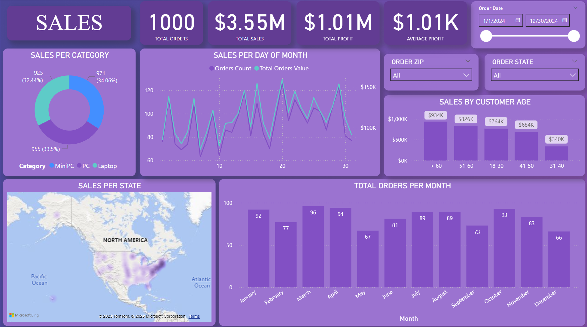
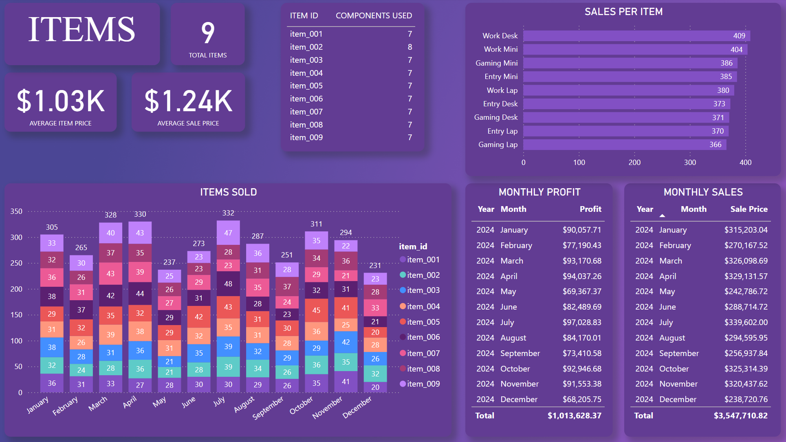
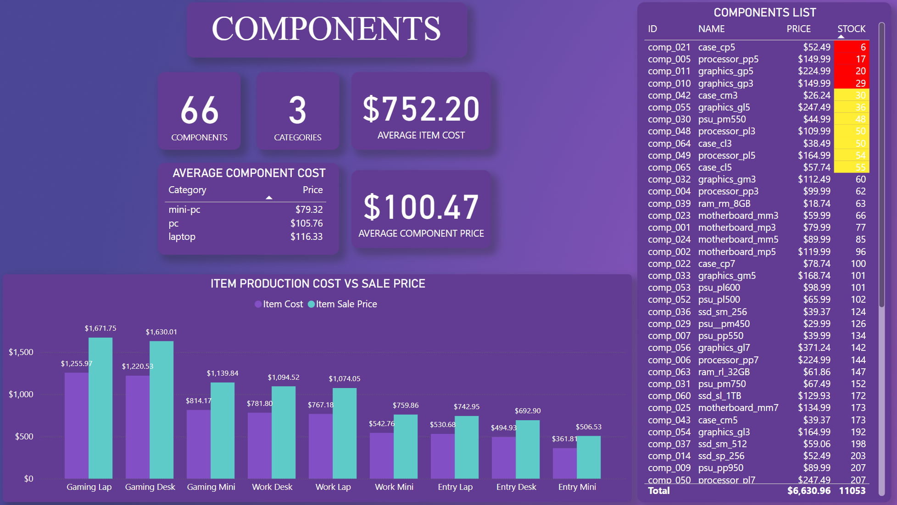
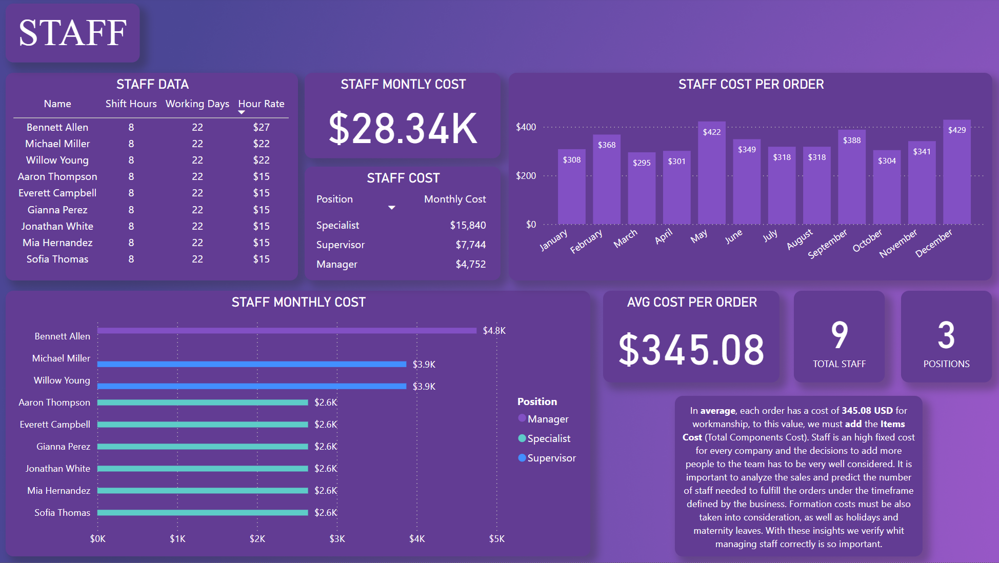

# Backend Project

## Files & Links

Dataset file Link: <a href= "[https://github.com/daviddiasm/Movies-Project/blob/main/movies_data.csv](https://github.com/daviddiasm/backend-project/tree/a6c738176c2f8ef4f0c0de88a82537956ab885da/Dataset)"> Dataset CSV Files </a>  

## Project Objectives

For this project, instead of selecting a pre-existing dataset to analyze, I decided to create my own. I populated it with randomly generated data and later visualized it using Power BI. To design the database structure, I used QuickDBD, which helped me define the tables and their relationships. After finalizing the design, I exported the schema and implemented it in Microsoft SQL Server Manager.  

Once the tables were created, I established the necessary relationships and made adjustments as needed.  

Next, I filled the tables with data using Excel's **“RANDBETWEEN”** function and a VBA macro. The data was generated based on custom lists that I compiled, which will be explained later in the project.  

The dataset represents a backend structure for a tech store that assembles custom PCs and laptops. The store purchases components and builds different models across various categories, with each model requiring specific parts. The database facilitates data collection from multiple business sectors, including:  

1. **Orders / Sales**
   - Sales details such as __Items purchased__, __Quantities__, __Customer Details__, __Order Date__.
3. **Customers**  
   - Customer's details such as __Name__, __Address__, __Age__.  
4. **Items**  
   - Items sold by the company
5. **Components**  
   - Parts used to assemble each item, varying in type and quantity.
6. **Inventory**  
   - Helps manage stock levels for components.
7. **Staff**  
   - Tracks employee costs and assigns staff to orders

This structured dataset serves as the foundation for analyzing various aspects of the business, providing insights into sales, inventory, and workforce management.

## Questions (KPIs)

1. What are the most sold __Items__ and their __average price__.
2. Which __Components__ are used the most, their __average cost__ and __categories__.
3. What is the stock level of each item?
4. Total __Items__ sold and the __company's profit__ with them.
5. Which __Customers__ are buying the most and when?
6. What are the costs with the __Staff__ how much those affect the company's profit.

## Process

- Used __QuickDBD__ to create the dabase schema and all the tables.
- Adjusted the __Datatype__, __Keys__ and __Relationships__ for all tables.
- Generated random data to fill the tables using __VBA__ and __RANDBETWEEN__ function in __Excel__. (Image below with the VBA codes)
- Created multiple custom __queries__ to use in __PowerBI__ and be able to feed some of the visuals. (Code of some queries below)
- Created __Visual Representation__ for for all areas (Sales, Items, Components, Staff).

<h3>Orders Table:</h3>

Created a total of 1000 Orders with random data, added different chance for the items purchased to avoid getting a evenly distributed dataset. (60% chance for 1 to 3 items, 40% for 4 to 7 items) 

<h3>Customers Table:</h3>
<table border="1">
    <tr>
        <th>customer_id</th>
        <th>customer_first_name</th>
        <th>customer_last_name</th>
        <th>customer_age</th>
    </tr>
    <tr>
        <td>cust_001 (Incremented by 1 till 100)</td>
        <td><a href="https://www.vitabiotics.com">Random from a list of 200 names (Male & Female)</a></td>
        <td><a href="https://www.al.com">Random from a list of 49 names</a></td>
        <td>Random between 18 and 65</td>
    </tr>
</table>

<h3>Address Table:</h3>
<table border="1">
    <tr>
        <th>address_id</th>
        <th>delivery_address</th>
        <th>delivery_state</th>
        <th>delivery_zip</th>
        <th>delivery_country</th>
    </tr>
    <tr>
        <td>address_001 (Increment by 1 till 200)</td>
        <td>Ran a Visual Basic module to randomly create a full address with 3 criteria: 
            <strong>Number:</strong> Between 1 & 9999 
            <strong>Name:</strong> Added an array with multiple possibilities 
            <strong>Type:</strong> Added another array with possibilities</td>
        <td>Created a list with all US States and then assigned them randomly</td>
        <td>Searched for 300 Zip codes from the US divided per state, then randomly assigned based on the state.</td>
        <td>Will always be US</td>
    </tr>
</table>

<h3>Items & Components & Item_Components Tables:</h3>

For these 2 tables I created the data manually, they are pretty small and was important to me to defined which kind of items and products were being sold.

For the __Components__ I created the following Logic:

- PC Components = Defined manually
- Laptop Components = PC Components * 1.1
- MiniPC Components = PC Components * 0.75
- Low Components = Defined manually
- Mid Components = Low Components * 1.5
- Top Components = Mid Components * 1.5

As for the __Items__ table the logic was the following:

- Calculated the __Sum__ of all __components price__ for each __Item__ and then added a 40% profit margin.

<h3>Inventory Table:</h3>

<table border="1">
    <tr>
        <th>inv_id</th>
        <th>component_inv_id</th>
        <th>quantity</th>
    </tr>
    <tr>
        <td>inv_001 (Incremented by 1)</td>
        <td>Linked to the component table</a></td>
        <td>Added randomly between 400 and 950.</td>
    </tr>
</table>

<h3>Staff Table:</h3>

<table border="1">
    <tr>
        <th>staff_id</th>
        <th>staff_first_name</th>
        <th>staff_last_name</th>
        <th>staff_position</th>
        <th>staff_hour_rate</th>
        <th>shift_hours</th>
        <th>monthly_working_days</th>        
    </tr>
    <tr>
        <th>staf_001 (Incremented by 1)</th>
        <th>Used the same method as for Customers names.</th>
        <th>Used the same method as for Customers names.</th>
        <th>Manager, Supervisor, Specialist</th>
        <th>3 Different for each Position</th>
        <th>All 8</th>
        <th>All 22</th></th>
    </tr>
</table>

<h2>SQL Queries</h2>

<b>Items Production Cost / Sale Price / Profit / Profit %</b>

<b>Components Stock and their Cost</b>

<b>Item Components and their Cost</b>

## Dashboard

## Project Insights 

- There are a total of **1000 orders** generating a total amount of **3.55 Million Dollars** in Sales
- Those 1000 orders made a total of **1.01 Millions** in **Profit**.
- **50%** of the **orders** were made from **customers** above **50 years old**.
- **March** was the month with more **Sales** in number (**96**).
- Most of the **Sales** come from the **Eastern States**.
- **8PM** is the hour generating more **orders** in **number** and **value**.
- The Items **Category** is evenly distributed between **32%** and **34%**.
- The **Average Item Price** is **$1.03K**.
- The **Average Item Cost** is **$752.20**.
- The **Average Order** price is **$1.24K**.
- **July** was the month with more **Items sold**.
- **July** was also the month with biggest **Profit** (**$97K**) and biggest **Revenue** (**$339 602.00**)
- **Work Desk**, **Work Mini** and **Gaming Mini** are the items with more sales.
- **Gaming Lap**, **Entry Lap** and **Gaming Desk** are the items with lowest sales.
- There are a total of **66** **Components** distributed into **3** different **Categories**.
- The **Average Component Price** is **$100.47**.
- Currently, the company has a total of **4 Components** with really **low stock** and **7** more close to it.
- The Company has currenty a total of **9 Employees** distributed in **3** different **Positions**.
- The entire **Staff** represents a **Monthly Cost** of **$28.34K** just in **Salaries**.
- In **Average**, the **Staff** represents a cost of **$345.08 per Order**.

## Final Conclusion

When I started the project was far from imagining that populate the data into the tables with random data would be so challenging and time consuming. Being able to produce a dataset with data that could actually be used to represent visualy is really complex. Having to consider the relationships between the tables and columns, distributing the data in a way it is not evenly distributed was what took me more time. For that I used VBA which I used in the past but not for this purpose. Also, creating custom queries that link the data to later use in PowerBI was the most interesting step for me. Also explored the PowerBI function DAX to create some columns, and explored the possibility to convert SQL queries into DAX using AI. Overall was such an interesting project and one that surprised and challanged me the most. No Machine Learning was used on this one nor I needed to clean and transform the data since I was the one creating it, however, this is a project that gets pretty close to the reallity of many companies and the challenges they face daily.

